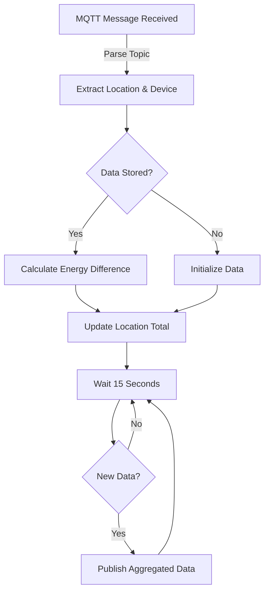

# Coreflux-Shelly-Aggregator

## Overview
This sample application leverages the Coreflux MQTT broker and Shelly devices to manage and control lighting systems efficiently. It's designed for use in any environment such as hotels, hospitals, and office buildings, offering centralized control and energy management.

## Setup
1. Install the necessary dependencies:
   ```
   pip install -r requirements.txt
   ```
2. Execute the application:
   ```
   python main.py
   ```

## Broker Configuration
- **Broker URL**: iot.coreflux.cloud (For testing only! Get your broker by making a trial)
- **Port**: 8883 (TLS)
- **Trial**: Try the broker using a free 14-day trial by signing up [here](https://mqtt.coreflux.org/).

## Unified Namespace

In MQTT, a unified namespace organizes the topic structure in a hierarchical and standardized manner. It allows scalable and flexible topic segmentation that can be easily understood and managed. In your project, topics like `Coreflux/Porto/MeetingRoom/Light1/status/switch:0` demonstrate a clear structure:

- **Coreflux**: Represents the company or the project.
- **City/Area**: Such as 'Porto', indicates the geographical location or logical division.
- **Location**: e.g., 'MeetingRoom', specifies the exact place within the area.
- **Device**: 'Light1', identifies the specific device.
- **Attribute**: 'status/switch:0', details the attribute of the device being monitored or controlled.

Using a structured topic format like `Coreflux/{City}/{Location}/{Device}/{Attribute}`, the project adopts a unified namespace to enhance data organization and retrieval across different geographical locations and device categories.

## Aggregation Behavior

Data is aggregated per device and per location, then summed to provide total energy usage per location. This aggregation occurs every 15 seconds if new data is present.

### Data Flow Diagram


## Use Cases
- **Hotels**: Automate and optimize lighting and heating based on real-time occupancy data.
- **Hospitals**: Manage energy use efficiently while ensuring patient comfort through automated systems.
- **Commercial Buildings**: Reduce energy costs with automated HVAC and lighting systems based on usage patterns.

## Shelly Devices
- Shelly devices are smart IoT gadgets for automating home and business environments, enabling remote control of electrical systems. Learn more about these devices on their [official website](https://www.shelly.com/en-pt).

## Files
- `main.py`: The entry point for initializing MQTT client and starting the system.
- `mqtt_client.py`: Manages MQTT communications, including publishing and subscribing.
- `data_aggregator.py`: Handles data aggregation for energy management.
- `requirements.txt`: Lists all dependencies.
